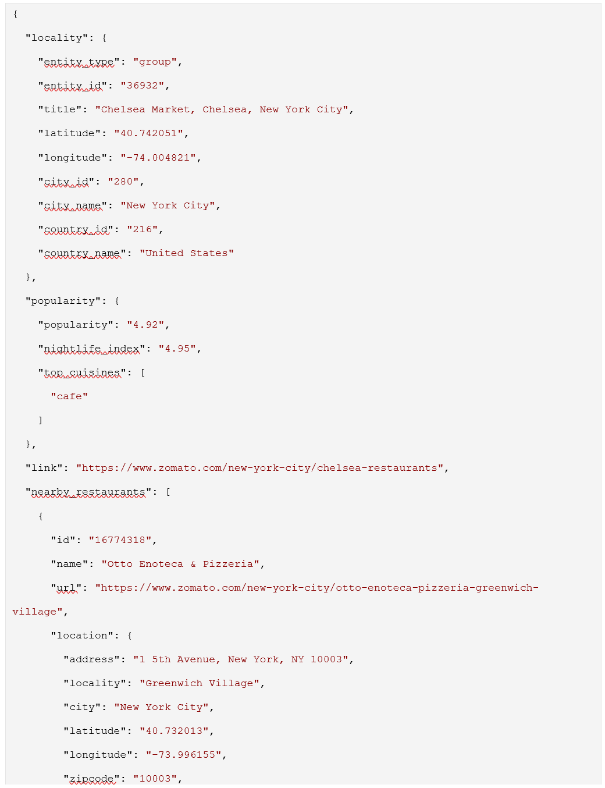
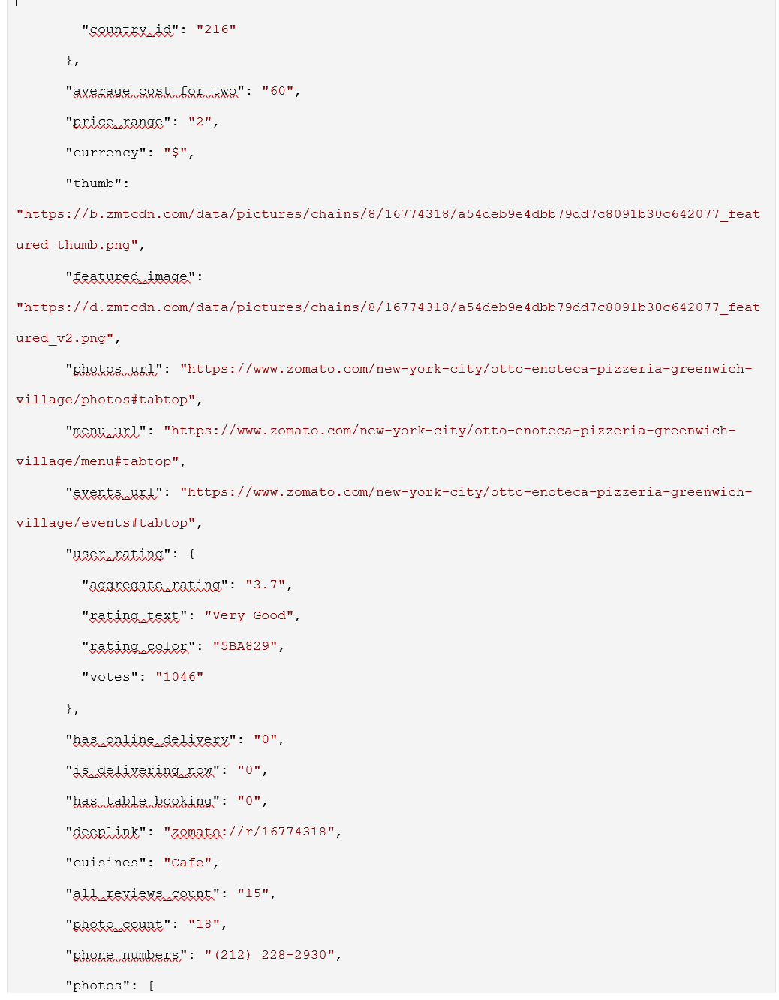
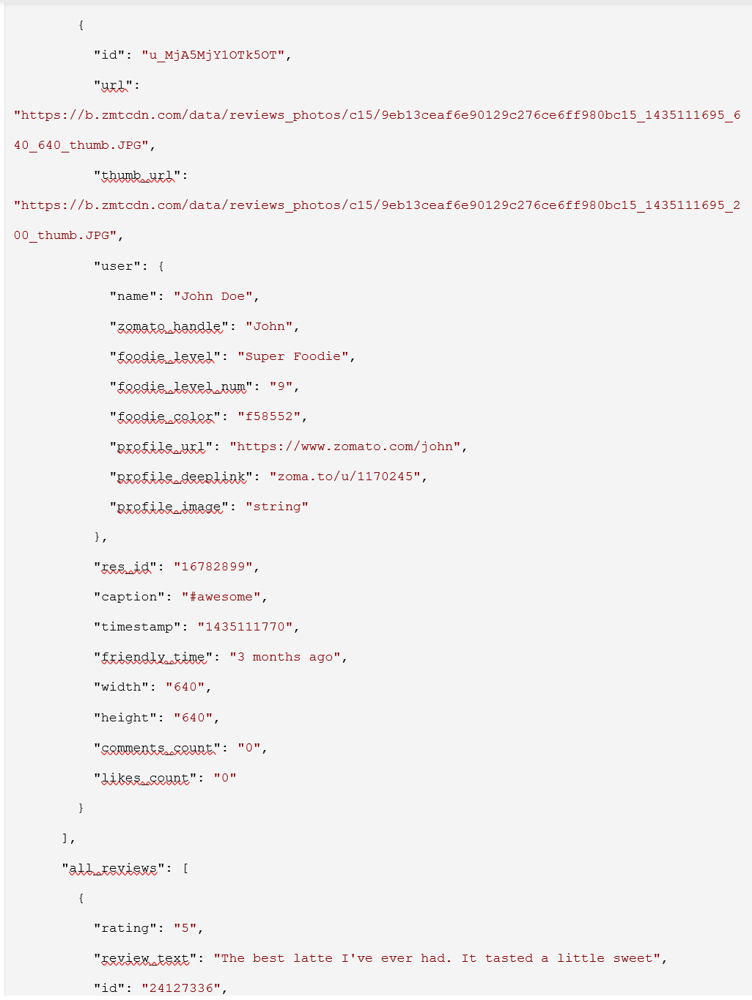
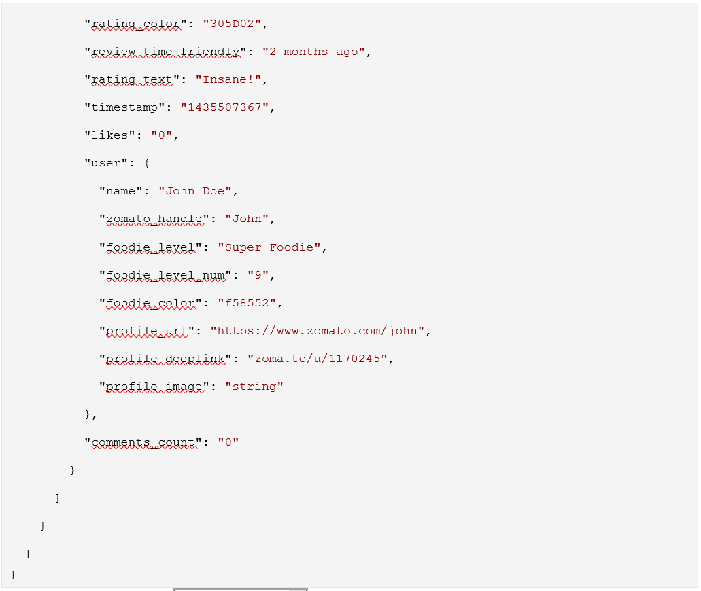

## INTRODUCTION

With the increasing number of e-commerce website and online users there has been a tremendous increase in the amount of data available in the web. For an item, say, a product, an event, an individual or a service, we may come across numerous forms of data such as reviews, ratings, opinions, complains, feedbacks, comments etc. Proper analysis of such data will enable businesses and individuals to make correct predictions and hence precise market decisions. Moreover, there are several recommendation systems which are based on ratings and reviews of an item which would enhance the decision making ability. With such explosion of web users and online systems there is an underlying need to analyse the large amount of data generated and transform the raw data into useful information. This is where Big Data technologies comes into picture.

The term Big Data is defined by four dimensions which are represented by four V's (Volume, Velocity, Variety, Veracity). Volume represents the amount of data generated. The speed at which data is generated comes under velocity. Variety represents different types of data extracted from different sources. The vailidity or trustworthyness of the data is denoted by the term Veracity. Each data generated online has these characteristics embedded and valuable information can be retrieved by applying Big data technologies mainly, Hadoop Framework. Hadoop provides its own file system HDFS (Hadoop Distributed File System) and all data is distributed into different clusters alnong with parallel processing.

In this project, our main objective is to analyse the restaurant data that is available online, processes it and produce useful information which will enable us to understand the business better and create a restaurant recommendation system using big data tools and methodologies. To achieve this, we used one of the restaurant APIs, Zomatao, a comprehensive restaurant search and food delivery app. This application provides customers with information, menus and user-reviewes of restaurants and food delivey options. Zomato maintains public API that gives access to the freshest and most exhaustive set of particulars for over 1.5 million restaurants across 10,000 cities globally. At present, they are spread over in 22 countries including India, UAE, USA etc. Canada is a newbie to Zomato with small number of locations. This limits the availability of data in and around Canada. The dataset fecthed from the Zomato API was then stored in Mongo DB, which is a NoSQL database, and then further processed with spark and Hadoop. The output of our analysis is visualized by a business intelligence tool called Supersets. Furthermore, we created a model that is a recommendation system by discovering data patterns in the datast and by learning user rating over locations.

The main motivation behind the implementation of this project is to learn big data technologies especially Mongo DB, Spark and Hadoop which is already trending in market these days. Also, creating a recommendation system with an interesting dataset such as restaurant data will sharpen our python programming sills along with exploration of Machine learning algorithms. We believe that amalgamation of these components will definitely be a hit combo and will encourage us to deep dive more into big data technologies and implement interesting projects in the future as well.

## APPROACH OVERVIEW

In this project, we did an analysis of restaurant data avaialble over 400 cities across USA using the Zomato API. The input data is taken from the API using Python programming language. Since the API requires a set of coordinates, a text file consisting of latitudes and    longitudes of approximately 400 cities is supplied in the python script. This data is then dumped into NoSQL database, in this case MongoDB which is a document oriented database. Spark, a fast, flexible and leading platform for large scale SQL processing and Machine Learning which is used in order to fetch this data to perform some preprocessing tasks as well as building a recommendation model and this cleaned data is put into HDFS. By using Hive, records are queried, by creating external tables over the Zomato information in HDFS. Finally, to illustrate some interesting results in the graph format, we used Apache Superset which is an incubator project that is a business intelligence web    application designed to be visual, intuitive and interactive. 

Some insights that we observed from the dataset are: 
 
1. Summary of the data.
2. Maximum rating and maximum cost. 
3. A view of different cuisines and the ratings for each of them
4. Top 10 most expensive restaurants
5. City versus text rating (average, good, bad etc)
6. Table Booking versus Cuisines

## PROJECT FRAMEWORK

### DATA PIPELINE

Below architecture is the data pipeline of this project.

 
### DATA COLLECTION - ZOMATO API

First step in our project is gathering data from a reliable source. We collected data from Zomato API. Geocodes (longitude and latitude) were collected and a python script was created to iterate over these geocodes to obtain restaurant data. We obtained popularity and nightlife index of the nearby restaurants around the given coordinates.

Model Schema of the collected data is as below:
 
 
 
 
### MONGO DB

The next step is to store the collected data in a database. We chose the NoSQL database Mongodb for this purpose as it provides high performance and scalability. Also auto replication feature of mongodb leads to high availability. Data was dumped to the DB using the same python program with which we collected the data. A DB called 'Zomato' was created and a collection called 'Restaurant' within it. 

 .png)
 .png)
### SPARK

Once the data was dumped to the Mongodb, the next step was to process the data. Apache Spark, which has in memory cluster computing that increases the speed an application, has been used to process our data. Using a mongo DB connector for Spark, the data has been read from mongodb to the spark environment. Data cleaning and unnecessary columns were dropped and final data frame with all required variables was created for further processing.

### HIVE

The final dataframe is stored in Hive as a table.

### SUPERSET

The final step is the visualization of our analysis of the restaurant data. We used a business intelliegence tool "Superset" for this purpose.